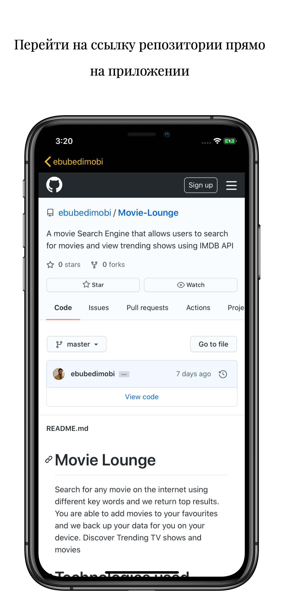

# Gittify
Приложение которое ищет аккаунты и смотреть информацию о репозиториях от Github

# Technologies used
- Xcode
- Swift
- Reactive Programming- RxSwift
- Networking
- REST API
- JSON Decoding
- Storyboards
- UITableView
- Custom UITableViewCell and XIB file
- UIKit
-WebKit
- AutoLayout
- Segues and Navigation
- Cocoapods

# Screenshots

